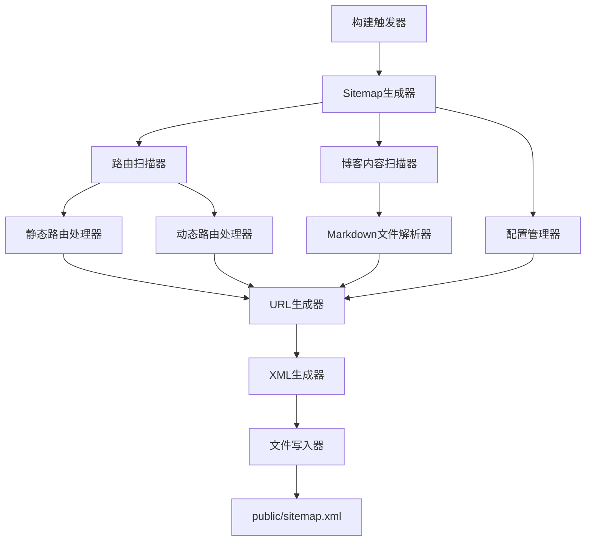

# 设计文档

## 概述

设计一个自动sitemap生成系统，用于Next.js项目。该系统将扫描app目录结构和博客内容，自动生成符合XML sitemap标准的文件。系统将集成到Next.js构建流程中，确保每次构建时都能生成最新的sitemap。

## 架构

### 核心组件架构



### 技术栈集成

- **Next.js构建钩子**: 使用Next.js的构建生命周期
- **文件系统API**: Node.js fs模块用于文件扫描和读写
- **现有博客系统**: 复用src/lib/blog.ts中的博客处理逻辑
- **TypeScript**: 确保类型安全和代码质量

## 组件和接口

### 1. 配置接口

```typescript
interface SitemapConfig {
  baseUrl: string;
  outputPath: string;
  excludePaths: string[];
  priorityMap: Record<string, number>;
  changeFreqMap: Record<string, string>;
  includeLastMod: boolean;
}
```

### 2. URL条目接口

```typescript
interface SitemapEntry {
  url: string;
  lastmod?: string;
  changefreq?: 'always' | 'hourly' | 'daily' | 'weekly' | 'monthly' | 'yearly' | 'never';
  priority?: number;
}
```

### 3. 路由扫描器接口

```typescript
interface RouteScanner {
  scanStaticRoutes(): Promise<string[]>;
  scanDynamicRoutes(): Promise<string[]>;
  getRouteMetadata(route: string): Promise<RouteMetadata>;
}
```

### 4. 博客扫描器接口

```typescript
interface BlogScanner {
  getAllBlogSlugs(): Promise<string[]>;
  getBlogMetadata(slug: string): Promise<BlogMetadata>;
}
```

## 数据模型

### 路由元数据模型

```typescript
interface RouteMetadata {
  path: string;
  type: 'static' | 'dynamic' | 'blog';
  lastModified: Date;
  priority: number;
  changeFreq: string;
}
```

### 博客元数据模型

```typescript
interface BlogMetadata {
  slug: string;
  publishDate: Date;
  lastModified: Date;
  title: string;
}
```

## 错误处理

### 错误类型定义

1. **文件系统错误**: 无法读取目录或文件
2. **解析错误**: Markdown文件格式错误
3. **配置错误**: 无效的配置参数
4. **写入错误**: 无法写入sitemap文件

### 错误处理策略

- **优雅降级**: 遇到单个文件错误时继续处理其他文件
- **日志记录**: 详细记录所有错误和警告
- **默认值**: 为缺失的元数据提供合理默认值
- **验证**: 在生成前验证所有URL的有效性

### 错误恢复机制

```typescript
class SitemapGenerator {
  private handleError(error: Error, context: string): void {
    console.warn(`Sitemap generation warning in ${context}:`, error.message);
    // 记录错误但继续执行
  }
  
  private validateUrl(url: string): boolean {
    try {
      new URL(url);
      return true;
    } catch {
      return false;
    }
  }
}
```

## 测试策略

### 单元测试

1. **路由扫描测试**: 验证能正确识别所有页面文件
2. **博客扫描测试**: 验证能正确解析博客文章
3. **URL生成测试**: 验证生成的URL格式正确
4. **XML生成测试**: 验证输出的XML符合sitemap标准

### 集成测试

1. **端到端测试**: 从扫描到生成完整流程测试
2. **文件系统测试**: 验证在不同文件结构下的行为
3. **配置测试**: 验证不同配置选项的效果

### 测试数据

```typescript
const mockFileStructure = {
  'app/page.tsx': { lastModified: '2024-01-01' },
  'app/blog/page.tsx': { lastModified: '2024-01-02' },
  'app/blog/[slug]/page.tsx': { lastModified: '2024-01-03' },
  'src/content/blog/post-1.md': { 
    content: '---\ntitle: Test Post\ndate: 2024-01-01\n---\nContent',
    lastModified: '2024-01-01'
  }
};
```

## 实现细节

### 构建集成

系统将通过以下方式集成到Next.js构建流程：

1. **构建脚本扩展**: 在package.json的build脚本中添加sitemap生成
2. **构建后钩子**: 在Next.js构建完成后自动执行
3. **开发模式支持**: 在开发模式下也能手动触发生成

### 性能优化

1. **缓存机制**: 缓存文件修改时间，避免重复扫描
2. **并行处理**: 并行扫描不同类型的内容
3. **增量更新**: 只处理修改过的文件

### 配置管理

默认配置将存储在项目根目录的`sitemap.config.js`文件中：

```javascript
module.exports = {
  baseUrl: 'https://multirun.space',
  excludePaths: ['/api', '/_next'],
  priorityMap: {
    '/': 1.0,
    '/blog': 0.8,
    '/hot-apps': 0.9,
    '/hot-games': 0.9,
    '/contact': 0.7
  },
  changeFreqMap: {
    '/': 'daily',
    '/blog': 'weekly',
    '/hot-apps': 'weekly',
    '/hot-games': 'weekly'
  }
};
```

### XML生成规范

生成的sitemap将严格遵循XML sitemap协议：

```xml
<?xml version="1.0" encoding="UTF-8"?>
<urlset xmlns="http://www.sitemaps.org/schemas/sitemap/0.9">
  <url>
    <loc>https://example.com/</loc>
    <lastmod>2024-01-01</lastmod>
    <changefreq>daily</changefreq>
    <priority>1.0</priority>
  </url>
</urlset>
```